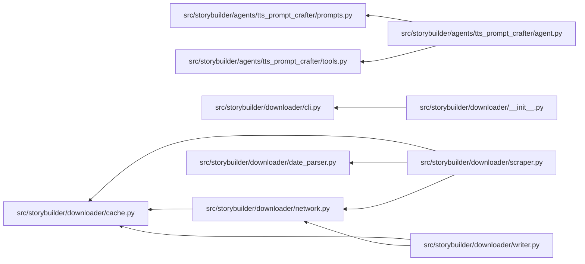

# Codebase Architecture and Flow Diagrams

This document contains Mermaid diagrams visualizing the codebase, automatically generated by the Codebase Diagrammer skill.

---

## 1. Directory & Component Structure
High-level layout of directories and files in the repository.

```mermaid
flowchart TD
    subgraph Root ["Workspace Root"]
        coverage[".coverage"]
        editorconfig[".editorconfig"]
        env[".env"]
        gitignore[".gitignore"]
        pre_commit_config_yaml[".pre-commit-config.yaml"]
        python_version[".python-version"]
        AGENTS_md["AGENTS.md"]
        README_md["README.md"]
        commit_message_txt["commit_message.txt"]
        dashboard_html["dashboard.html"]
        main_py["main.py"]
        nlp_analysis_db["nlp_analysis.db"]
        pyproject_toml["pyproject.toml"]
        story_builder_architecture_md["story_builder_architecture.md"]
        streamlit_output_log["streamlit_output.log"]
        test_db["test.db"]
        tsne_visualization_html["tsne_visualization.html"]
        tts_prompt_crafter_db["tts_prompt_crafter.db"]
        uv_lock["uv.lock"]
        workspace_config_yaml["workspace_config.yaml"]
    end

    subgraph Jules ["/.Jules"]
        Jules_palette_md["palette.md"]
    end

    subgraph cache ["/.cache"]
        cache_huggingface__gitignore["huggingface/.gitignore"]
        cache_huggingface_CACHEDIR_TAG["huggingface/CACHEDIR.TAG"]
        cache_huggingface_download_voices_json_metadata["huggingface/download/voices.json.metadata"]
    end

    subgraph circleci ["/.circleci"]
        circleci_config_yml["config.yml"]
    end

    subgraph remember ["/.remember"]
        remember__gitignore[".gitignore"]
        remember_logs_autonomous_save_032846_log["logs/autonomous/save-032846.log"]
        remember_logs_autonomous_save_032847_log["logs/autonomous/save-032847.log"]
        remember_logs_autonomous_save_032848_log["logs/autonomous/save-032848.log"]
        remember_logs_autonomous_save_032849_log["logs/autonomous/save-032849.log"]
        remember_logs_autonomous_save_032850_log["logs/autonomous/save-032850.log"]
        remember_logs_autonomous_save_032851_log["logs/autonomous/save-032851.log"]
        remember_logs_autonomous_save_032852_log["logs/autonomous/save-032852.log"]
        remember_logs_autonomous_save_032854_log["logs/autonomous/save-032854.log"]
        remember_logs_autonomous_save_032855_log["logs/autonomous/save-032855.log"]
        remember_logs_autonomous_save_032856_log["logs/autonomous/save-032856.log"]
        remember_logs_autonomous_save_032857_log["logs/autonomous/save-032857.log"]
        remember_logs_autonomous_save_032858_log["logs/autonomous/save-032858.log"]
        remember_logs_autonomous_save_032859_log["logs/autonomous/save-032859.log"]
        remember_logs_autonomous_save_032902_log["logs/autonomous/save-032902.log"]
        remember_logs_autonomous_save_032904_log["logs/autonomous/save-032904.log"]
        remember_logs_autonomous_save_032905_log["logs/autonomous/save-032905.log"]
        remember_logs_autonomous_save_032906_log["logs/autonomous/save-032906.log"]
        remember_logs_autonomous_save_032909_log["logs/autonomous/save-032909.log"]
        remember_logs_autonomous_save_032911_log["logs/autonomous/save-032911.log"]
        remember_logs_autonomous_save_032912_log["logs/autonomous/save-032912.log"]
        remember_logs_autonomous_save_032914_log["logs/autonomous/save-032914.log"]
        remember_logs_autonomous_save_032916_log["logs/autonomous/save-032916.log"]
        remember_logs_autonomous_save_032917_log["logs/autonomous/save-032917.log"]
        remember_logs_autonomous_save_032919_log["logs/autonomous/save-032919.log"]
        remember_logs_autonomous_save_032920_log["logs/autonomous/save-032920.log"]
        remember_logs_autonomous_save_032921_log["logs/autonomous/save-032921.log"]
        remember_logs_autonomous_save_032922_log["logs/autonomous/save-032922.log"]
        remember_logs_autonomous_save_032923_log["logs/autonomous/save-032923.log"]
        remember_logs_autonomous_save_032927_log["logs/autonomous/save-032927.log"]
        remember_logs_autonomous_save_032932_log["logs/autonomous/save-032932.log"]
        remember_logs_autonomous_save_032936_log["logs/autonomous/save-032936.log"]
        remember_logs_autonomous_save_032951_log["logs/autonomous/save-032951.log"]
        remember_logs_autonomous_save_033025_log["logs/autonomous/save-033025.log"]
        remember_logs_autonomous_save_033029_log["logs/autonomous/save-033029.log"]
        remember_logs_autonomous_save_033030_log["logs/autonomous/save-033030.log"]
        remember_logs_autonomous_save_033035_log["logs/autonomous/save-033035.log"]
        remember_logs_autonomous_save_033036_log["logs/autonomous/save-033036.log"]
        remember_logs_autonomous_save_033040_log["logs/autonomous/save-033040.log"]
        remember_logs_autonomous_save_033044_log["logs/autonomous/save-033044.log"]
        remember_logs_autonomous_save_033102_log["logs/autonomous/save-033102.log"]
        remember_logs_autonomous_save_033126_log["logs/autonomous/save-033126.log"]
        remember_logs_autonomous_save_033127_log["logs/autonomous/save-033127.log"]
        remember_logs_autonomous_save_033133_log["logs/autonomous/save-033133.log"]
        remember_logs_autonomous_save_033213_log["logs/autonomous/save-033213.log"]
        remember_logs_autonomous_save_033214_log["logs/autonomous/save-033214.log"]
        remember_logs_autonomous_save_033215_log["logs/autonomous/save-033215.log"]
        remember_logs_autonomous_save_033216_log["logs/autonomous/save-033216.log"]
        remember_logs_autonomous_save_033217_log["logs/autonomous/save-033217.log"]
        remember_logs_autonomous_save_033218_log["logs/autonomous/save-033218.log"]
        remember_logs_autonomous_save_033220_log["logs/autonomous/save-033220.log"]
        remember_logs_autonomous_save_033221_log["logs/autonomous/save-033221.log"]
        remember_logs_autonomous_save_033222_log["logs/autonomous/save-033222.log"]
        remember_logs_autonomous_save_033225_log["logs/autonomous/save-033225.log"]
        remember_logs_autonomous_save_033226_log["logs/autonomous/save-033226.log"]
        remember_logs_autonomous_save_033227_log["logs/autonomous/save-033227.log"]
        remember_logs_autonomous_save_033229_log["logs/autonomous/save-033229.log"]
        remember_logs_autonomous_save_033231_log["logs/autonomous/save-033231.log"]
        remember_logs_autonomous_save_033232_log["logs/autonomous/save-033232.log"]
        remember_logs_autonomous_save_033233_log["logs/autonomous/save-033233.log"]
        remember_logs_autonomous_save_033235_log["logs/autonomous/save-033235.log"]
        remember_logs_autonomous_save_033237_log["logs/autonomous/save-033237.log"]
        remember_logs_autonomous_save_033238_log["logs/autonomous/save-033238.log"]
        remember_logs_autonomous_save_033239_log["logs/autonomous/save-033239.log"]
        remember_logs_autonomous_save_033241_log["logs/autonomous/save-033241.log"]
        remember_logs_autonomous_save_033242_log["logs/autonomous/save-033242.log"]
        remember_logs_autonomous_save_033243_log["logs/autonomous/save-033243.log"]
        remember_logs_autonomous_save_033244_log["logs/autonomous/save-033244.log"]
        remember_logs_autonomous_save_033245_log["logs/autonomous/save-033245.log"]
        remember_logs_autonomous_save_033246_log["logs/autonomous/save-033246.log"]
        remember_logs_autonomous_save_033247_log["logs/autonomous/save-033247.log"]
        remember_logs_autonomous_save_033248_log["logs/autonomous/save-033248.log"]
        remember_logs_autonomous_save_033249_log["logs/autonomous/save-033249.log"]
        remember_logs_autonomous_save_033252_log["logs/autonomous/save-033252.log"]
        remember_logs_autonomous_save_033253_log["logs/autonomous/save-033253.log"]
        remember_logs_autonomous_save_033255_log["logs/autonomous/save-033255.log"]
        remember_logs_autonomous_save_033256_log["logs/autonomous/save-033256.log"]
        remember_logs_autonomous_save_033257_log["logs/autonomous/save-033257.log"]
        remember_logs_autonomous_save_033259_log["logs/autonomous/save-033259.log"]
        remember_logs_autonomous_save_033300_log["logs/autonomous/save-033300.log"]
        remember_logs_autonomous_save_033302_log["logs/autonomous/save-033302.log"]
        remember_logs_autonomous_save_033303_log["logs/autonomous/save-033303.log"]
        remember_logs_autonomous_save_033304_log["logs/autonomous/save-033304.log"]
        remember_logs_autonomous_save_033306_log["logs/autonomous/save-033306.log"]
        remember_logs_autonomous_save_033307_log["logs/autonomous/save-033307.log"]
        remember_logs_autonomous_save_033309_log["logs/autonomous/save-033309.log"]
        remember_logs_autonomous_save_033313_log["logs/autonomous/save-033313.log"]
        remember_logs_autonomous_save_033316_log["logs/autonomous/save-033316.log"]
        remember_logs_autonomous_save_033319_log["logs/autonomous/save-033319.log"]
        remember_logs_autonomous_save_033321_log["logs/autonomous/save-033321.log"]
        remember_logs_autonomous_save_033323_log["logs/autonomous/save-033323.log"]
        remember_logs_autonomous_save_033327_log["logs/autonomous/save-033327.log"]
        remember_logs_autonomous_save_033328_log["logs/autonomous/save-033328.log"]
        remember_logs_autonomous_save_033331_log["logs/autonomous/save-033331.log"]
        remember_logs_autonomous_save_033335_log["logs/autonomous/save-033335.log"]
        remember_logs_autonomous_save_033343_log["logs/autonomous/save-033343.log"]
        remember_logs_autonomous_save_033350_log["logs/autonomous/save-033350.log"]
        remember_logs_autonomous_save_033421_log["logs/autonomous/save-033421.log"]
        remember_logs_hook_errors_log["logs/hook-errors.log"]
        remember_logs_memory_2026_07_05_log["logs/memory-2026-07-05.log"]
        remember_logs_memory_2026_07_07_log["logs/memory-2026-07-07.log"]
        remember_tmp_last_save_ts["tmp/last-save-ts"]
        remember_tmp_save_session_pid["tmp/save-session.pid"]
    end

    subgraph ruff_cache ["/.ruff_cache"]
        ruff_cache__gitignore[".gitignore"]
        ruff_cache_0_15_20_10920748241692982898["0.15.20/10920748241692982898"]
        ruff_cache_0_15_20_12762437413367970838["0.15.20/12762437413367970838"]
        ruff_cache_0_15_20_12978097677722581201["0.15.20/12978097677722581201"]
        ruff_cache_0_15_20_13336697158392665983["0.15.20/13336697158392665983"]
        ruff_cache_0_15_20_16856934902324148593["0.15.20/16856934902324148593"]
        ruff_cache_0_15_20_17902867987264140765["0.15.20/17902867987264140765"]
        ruff_cache_0_15_20_18157393575109990307["0.15.20/18157393575109990307"]
        ruff_cache_0_15_20_2833023246256783409["0.15.20/2833023246256783409"]
        ruff_cache_0_15_20_4766467464010666580["0.15.20/4766467464010666580"]
        ruff_cache_0_15_20_5562636807061282894["0.15.20/5562636807061282894"]
        ruff_cache_0_15_20_6257567737622370623["0.15.20/6257567737622370623"]
        ruff_cache_0_15_20_9095579945794911264["0.15.20/9095579945794911264"]
        ruff_cache_CACHEDIR_TAG["CACHEDIR.TAG"]
    end

    subgraph vscode ["/.vscode"]
        vscode_feature_to_tasks_prompt_yml["feature-to-tasks.prompt.yml"]
        vscode_launch_json["launch.json"]
        vscode_settings_json["settings.json"]
        vscode_tasks_json["tasks.json"]
    end

    subgraph ContextPool ["/ContextPool"]
        ContextPool_projects_github_com_jgf_dev_story_builder_project_json["projects/github.com-jgf-dev-story-builder/project.json"]
    end

    subgraph evals ["/evals"]
        evals_README_md["README.md"]
        evals_agentic___init___py["agentic/__init__.py"]
        evals_agentic_reflection_evaluator_py["agentic/reflection_evaluator.py"]
        evals_agentic_rubric_evaluator_py["agentic/rubric_evaluator.py"]
        evals_conftest_py["conftest.py"]
        evals_run_adk_eval_py["run_adk_eval.py"]
        evals_test_adk_eval_sets_py["test_adk_eval_sets.py"]
        evals_test_tts_prompt_crafter_agentic_py["test_tts_prompt_crafter_agentic.py"]
    end

    subgraph nifty_stories ["/nifty_stories"]
        nifty_stories_metadata_cache_json["metadata_cache.json"]
    end

    subgraph scripts ["/scripts"]
        scripts_dashboard_py["dashboard.py"]
        scripts_import_to_sqlite_py["import_to_sqlite.py"]
        scripts_migrate_email_date_py["migrate_email_date.py"]
        scripts_repartition_db_py["repartition_db.py"]
        scripts_story_db_py["story_db.py"]
    end

    subgraph src ["/src"]
        src_storybuilder___init___py["storybuilder/__init__.py"]
        src_storybuilder_agents__adk_session_db["storybuilder/agents/.adk/session.db"]
        src_storybuilder_agents__adk_vertex_ai_py["storybuilder/agents/.adk/vertex_ai.py"]
        src_storybuilder_agents___init___py["storybuilder/agents/__init__.py"]
        src_storybuilder_agents_cartesia_tts_prompt_crafter_emotion_analyzer_yaml["storybuilder/agents/cartesia_tts_prompt_crafter/emotion_analyzer.yaml"]
        src_storybuilder_agents_cartesia_tts_prompt_crafter_markdown_parser_yaml["storybuilder/agents/cartesia_tts_prompt_crafter/markdown_parser.yaml"]
        src_storybuilder_agents_cartesia_tts_prompt_crafter_prompt_formatter_yaml["storybuilder/agents/cartesia_tts_prompt_crafter/prompt_formatter.yaml"]
        src_storybuilder_agents_cartesia_tts_prompt_crafter_root_agent_yaml["storybuilder/agents/cartesia_tts_prompt_crafter/root_agent.yaml"]
        src_storybuilder_agents_cartesia_tts_prompt_crafter_tools___init___py["storybuilder/agents/cartesia_tts_prompt_crafter/tools/__init__.py"]
        src_storybuilder_agents_cartesia_tts_prompt_crafter_tools_prompt_tool_py["storybuilder/agents/cartesia_tts_prompt_crafter/tools/prompt_tool.py"]
        src_storybuilder_agents_cartesia_tts_prompt_crafter_tts_prompt_crafter_yaml["storybuilder/agents/cartesia_tts_prompt_crafter/tts_prompt_crafter.yaml"]
        src_storybuilder_agents_tts_prompt_crafter__adk_eval_history_tts_prompt_crafter_eval_set_1_1781855276_3733985_evalset_result_json["storybuilder/agents/tts_prompt_crafter/.adk/eval_history/tts_prompt_crafter_eval_set_1_1781855276.3733985.evalset_result.json"]
        src_storybuilder_agents_tts_prompt_crafter__adk_session_db["storybuilder/agents/tts_prompt_crafter/.adk/session.db"]
        src_storybuilder_agents_tts_prompt_crafter___init___py["storybuilder/agents/tts_prompt_crafter/__init__.py"]
        src_storybuilder_agents_tts_prompt_crafter_agent_py["storybuilder/agents/tts_prompt_crafter/agent.py"]
        src_storybuilder_agents_tts_prompt_crafter_eval_set_1_evalset_json["storybuilder/agents/tts_prompt_crafter/eval_set_1.evalset.json"]
        src_storybuilder_agents_tts_prompt_crafter_prompts__adk_session_db["storybuilder/agents/tts_prompt_crafter/prompts/.adk/session.db"]
        src_storybuilder_agents_tts_prompt_crafter_prompts_gay_ya_md["storybuilder/agents/tts_prompt_crafter/prompts/gay-ya.md"]
        src_storybuilder_agents_tts_prompt_crafter_prompts_scene_writer_md["storybuilder/agents/tts_prompt_crafter/prompts/scene-writer.md"]
        src_storybuilder_agents_tts_prompt_crafter_prompts_story_analyzer_md["storybuilder/agents/tts_prompt_crafter/prompts/story-analyzer.md"]
        src_storybuilder_agents_tts_prompt_crafter_prompts_tts_prompt_crafter_md["storybuilder/agents/tts_prompt_crafter/prompts/tts-prompt-crafter.md"]
        src_storybuilder_agents_tts_prompt_crafter_prompts_py["storybuilder/agents/tts_prompt_crafter/prompts.py"]
        src_storybuilder_agents_tts_prompt_crafter_tools_py["storybuilder/agents/tts_prompt_crafter/tools.py"]
        src_storybuilder_analysis___init___py["storybuilder/analysis/__init__.py"]
        src_storybuilder_analysis_analyze_sentiment_py["storybuilder/analysis/analyze_sentiment.py"]
        src_storybuilder_analysis_compare_narratives_py["storybuilder/analysis/compare_narratives.py"]
        src_storybuilder_analysis_extract_entities_py["storybuilder/analysis/extract_entities.py"]
        src_storybuilder_analysis_find_similar_py["storybuilder/analysis/find_similar.py"]
        src_storybuilder_analysis_generate_embeddings_py["storybuilder/analysis/generate_embeddings.py"]
        src_storybuilder_analysis_visualize_arcs_py["storybuilder/analysis/visualize_arcs.py"]
        src_storybuilder_analysis_visualize_tsne_py["storybuilder/analysis/visualize_tsne.py"]
        src_storybuilder_dashboard___init___py["storybuilder/dashboard/__init__.py"]
        src_storybuilder_dashboard_config_py["storybuilder/dashboard/config.py"]
        src_storybuilder_dashboard_data_py["storybuilder/dashboard/data.py"]
        src_storybuilder_dashboard_pages___init___py["storybuilder/dashboard/pages/__init__.py"]
        src_storybuilder_dashboard_pages_archive_stats_py["storybuilder/dashboard/pages/archive_stats.py"]
        src_storybuilder_dashboard_pages_favorites_tags_py["storybuilder/dashboard/pages/favorites_tags.py"]
        src_storybuilder_dashboard_pages_read_story_py["storybuilder/dashboard/pages/read_story.py"]
        src_storybuilder_dashboard_pages_search_explorer_py["storybuilder/dashboard/pages/search_explorer.py"]
        src_storybuilder_dashboard_ui___init___py["storybuilder/dashboard/ui/__init__.py"]
        src_storybuilder_dashboard_ui_sidebar_py["storybuilder/dashboard/ui/sidebar.py"]
        src_storybuilder_downloader___init___py["storybuilder/downloader/__init__.py"]
        src_storybuilder_downloader_cache_py["storybuilder/downloader/cache.py"]
        src_storybuilder_downloader_cli_py["storybuilder/downloader/cli.py"]
        src_storybuilder_downloader_date_parser_py["storybuilder/downloader/date_parser.py"]
        src_storybuilder_downloader_db_py["storybuilder/downloader/db.py"]
        src_storybuilder_downloader_network_py["storybuilder/downloader/network.py"]
        src_storybuilder_downloader_scraper_py["storybuilder/downloader/scraper.py"]
        src_storybuilder_downloader_storage_py["storybuilder/downloader/storage.py"]
        src_storybuilder_downloader_writer_py["storybuilder/downloader/writer.py"]
        src_storybuilder_genai___init___py["storybuilder/genai/__init__.py"]
        src_storybuilder_genai_cartesia_client_py["storybuilder/genai/cartesia_client.py"]
        src_storybuilder_genai_client_py["storybuilder/genai/client.py"]
        src_storybuilder_genai_fix_prompts_py["storybuilder/genai/fix_prompts.py"]
        src_storybuilder_genai_fix_prompts2_py["storybuilder/genai/fix_prompts2.py"]
        src_storybuilder_genai_play_audio_py["storybuilder/genai/play_audio.py"]
        src_storybuilder_genai_test_voices_py["storybuilder/genai/test_voices.py"]
        src_storybuilder_utils___init___py["storybuilder/utils/__init__.py"]
        src_storybuilder_utils_storage_py["storybuilder/utils/storage.py"]
        src_storybuilder_voices_piper_tts_voices_json["storybuilder/voices/piper-tts/voices.json"]
    end

    subgraph stories ["/stories"]
        stories_db_1990_db["db/1990.db"]
        stories_db_1991_db["db/1991.db"]
        stories_db_1992_db["db/1992.db"]
        stories_db_1993_db["db/1993.db"]
        stories_db_1994_db["db/1994.db"]
        stories_db_1995_db["db/1995.db"]
        stories_db_1996_db["db/1996.db"]
        stories_db_1997_db["db/1997.db"]
        stories_db_1998_db["db/1998.db"]
        stories_db_1999_db["db/1999.db"]
        stories_db_2000_db["db/2000.db"]
        stories_db_2001_db["db/2001.db"]
        stories_db_2002_db["db/2002.db"]
        stories_db_2003_db["db/2003.db"]
        stories_db_2004_db["db/2004.db"]
        stories_db_2005_db["db/2005.db"]
        stories_db_2006_db["db/2006.db"]
        stories_db_2007_db["db/2007.db"]
        stories_db_2008_db["db/2008.db"]
        stories_db_2009_db["db/2009.db"]
        stories_db_2010_db["db/2010.db"]
        stories_db_2011_db["db/2011.db"]
        stories_db_2012_db["db/2012.db"]
        stories_db_2013_db["db/2013.db"]
        stories_db_2014_db["db/2014.db"]
        stories_db_2015_db["db/2015.db"]
        stories_db_2016_db["db/2016.db"]
        stories_db_2017_db["db/2017.db"]
        stories_db_2018_db["db/2018.db"]
        stories_db_2019_db["db/2019.db"]
        stories_db_2020_db["db/2020.db"]
        stories_db_2021_db["db/2021.db"]
        stories_db_2022_db["db/2022.db"]
        stories_db_2023_db["db/2023.db"]
        stories_db_2024_db["db/2024.db"]
        stories_db_2025_db["db/2025.db"]
        stories_db_2026_db["db/2026.db"]
        stories_db_dashboard_metadata_db["db/dashboard_metadata.db"]
        stories_db_nlp_analysis_db["db/nlp_analysis.db"]
        stories_db_sentiment_analysis_db["db/sentiment_analysis.db"]
        stories_db_sentiment_analysis_db_journal["db/sentiment_analysis.db-journal"]
        stories_db_stories_db["db/stories.db"]
        stories_db_tts_prompt_crafter_db["db/tts_prompt_crafter.db"]
        stories_text_i_came_during_tryouts_md["text/i_came_during_tryouts.md"]
        stories_text_metadata_cache_json["text/metadata_cache.json"]
        stories_text_output_01_part_md["text/output/01-part.md"]
        stories_text_output_01_scene1_md["text/output/01-scene1.md"]
        stories_text_output_01_scene2_md["text/output/01-scene2.md"]
        stories_text_output_02_part_md["text/output/02-part.md"]
        stories_text_output_03_part_md["text/output/03-part.md"]
        stories_text_output_04_part_md["text/output/04-part.md"]
        stories_text_output_05_part_md["text/output/05-part.md"]
        stories_text_output_06_part_md["text/output/06-part.md"]
        stories_text_output_07_part_md["text/output/07-part.md"]
        stories_text_output_08_part_md["text/output/08-part.md"]
        stories_text_output_09_part_md["text/output/09-part.md"]
        stories_text_output_10_part_md["text/output/10-part.md"]
        stories_text_output_11_part_md["text/output/11-part.md"]
        stories_text_output_12_part_md["text/output/12-part.md"]
        stories_text_output_13_part_md["text/output/13-part.md"]
        stories_text_output_14_part_md["text/output/14-part.md"]
        stories_text_output_archive_01_part_md["text/output/archive/01-part.md"]
        stories_text_output_archive_01_scene1_md["text/output/archive/01-scene1.md"]
        stories_text_output_archive_01_scene2_md["text/output/archive/01-scene2.md"]
        stories_text_output_archive_01_scene3_md["text/output/archive/01-scene3.md"]
        stories_text_output_archive_01_scene4_md["text/output/archive/01-scene4.md"]
        stories_text_output_archive_02_part_md["text/output/archive/02-part.md"]
        stories_text_output_archive_02_scene2_md["text/output/archive/02-scene2.md"]
        stories_text_output_archive_03_scene3_md["text/output/archive/03-scene3.md"]
        stories_text_output_archive_04_scene4_md["text/output/archive/04-scene4.md"]
        stories_text_output_archive_05_scene5_md["text/output/archive/05-scene5.md"]
        stories_text_output_archive_06_scene6_md["text/output/archive/06-scene6.md"]
        stories_text_output_i_came_during_tryouts_01_part_md["text/output/i_came_during_tryouts/01-part.md"]
        stories_text_output_i_came_during_tryouts_01_part_wav["text/output/i_came_during_tryouts/01-part.wav"]
        stories_text_output_i_came_during_tryouts_02_part_md["text/output/i_came_during_tryouts/02-part.md"]
        stories_text_output_i_came_during_tryouts_02_part_wav["text/output/i_came_during_tryouts/02-part.wav"]
        stories_text_output_i_came_during_tryouts_03_part_md["text/output/i_came_during_tryouts/03-part.md"]
        stories_text_output_i_came_during_tryouts_03_part_wav["text/output/i_came_during_tryouts/03-part.wav"]
        stories_text_output_i_came_during_tryouts_04_part_md["text/output/i_came_during_tryouts/04-part.md"]
        stories_text_output_i_came_during_tryouts_04_part_wav["text/output/i_came_during_tryouts/04-part.wav"]
        stories_text_output_i_came_during_tryouts_daw_md["text/output/i_came_during_tryouts/daw.md"]
        stories_text_output_the_secret_vacation_1_I_scenes_01_scene1_md["text/output/the_secret_vacation_1_I_scenes/01-scene1.md"]
        stories_text_output_the_secret_vacation_1_I_scenes_01_scene1_wav["text/output/the_secret_vacation_1_I_scenes/01-scene1.wav"]
        stories_text_output_the_secret_vacation_1_I_scenes_02_scene2_md["text/output/the_secret_vacation_1_I_scenes/02-scene2.md"]
        stories_text_output_the_secret_vacation_1_I_scenes_02_scene2_wav["text/output/the_secret_vacation_1_I_scenes/02-scene2.wav"]
        stories_text_output_the_secret_vacation_1_I_scenes_03_scene3_md["text/output/the_secret_vacation_1_I_scenes/03-scene3.md"]
        stories_text_output_the_secret_vacation_1_I_scenes_03_scene3_wav["text/output/the_secret_vacation_1_I_scenes/03-scene3.wav"]
        stories_text_output_the_secret_vacation_1_I_scenes_04_scene4_md["text/output/the_secret_vacation_1_I_scenes/04-scene4.md"]
        stories_text_output_the_secret_vacation_1_I_scenes_04_scene4_wav["text/output/the_secret_vacation_1_I_scenes/04-scene4.wav"]
        stories_text_the_secret_vacation_1_I_md["text/the_secret_vacation-1-I.md"]
        stories_text_the_secret_vacation_1_II_md["text/the_secret_vacation-1-II.md"]
        stories_text_the_secret_vacation_2_I_md["text/the_secret_vacation-2-I.md"]
        stories_text_the_secret_vacation_2_II_md["text/the_secret_vacation-2-II.md"]
    end

    subgraph tasks ["/tasks"]
        tasks_CHANGELOG_md["CHANGELOG.md"]
        tasks_INTERFACE_md["INTERFACE.md"]
        tasks_NLP_TASKS_md["NLP_TASKS.md"]
        tasks_TASKS_md["TASKS.md"]
        tasks_dashboard_refactor_draft_md["dashboard_refactor_draft.md"]
    end

    subgraph tests ["/tests"]
        tests_agents_test_agent_smoke_py["agents/test_agent_smoke.py"]
        tests_agents_test_agent_tools_py["agents/test_agent_tools.py"]
        tests_agents_test_subagent_py["agents/test_subagent.py"]
        tests_analysis_test_analyze_sentiment_py["analysis/test_analyze_sentiment.py"]
        tests_analysis_test_compare_narratives_py["analysis/test_compare_narratives.py"]
        tests_analysis_test_extract_entities_py["analysis/test_extract_entities.py"]
        tests_analysis_test_find_similar_py["analysis/test_find_similar.py"]
        tests_analysis_test_generate_embeddings_py["analysis/test_generate_embeddings.py"]
        tests_analysis_test_visualize_arcs_py["analysis/test_visualize_arcs.py"]
        tests_analysis_test_visualize_tsne_py["analysis/test_visualize_tsne.py"]
        tests_downloader_test_cli_py["downloader/test_cli.py"]
        tests_downloader_test_dashboard_py["downloader/test_dashboard.py"]
        tests_downloader_test_database_py["downloader/test_database.py"]
        tests_downloader_test_downloader_py["downloader/test_downloader.py"]
        tests_downloader_test_network_py["downloader/test_network.py"]
        tests_genai_test_cartesia_py["genai/test_cartesia.py"]
        tests_genai_test_genai_py["genai/test_genai.py"]
        tests_genai_test_parse_speech_config_py["genai/test_parse_speech_config.py"]
        tests_genai_test_parse_speech_config_split_py["genai/test_parse_speech_config_split.py"]
        tests_genai_test_split_prompts_py["genai/test_split_prompts.py"]
        tests_genai_test_tts_pipeline_py["genai/test_tts_pipeline.py"]
        tests_misc_test_keys_py["misc/test_keys.py"]
        tests_misc_test_storage_py["misc/test_storage.py"]
    end
```

---

## 2. Module & File Dependencies
Visualizes import relationships and dependency flows between local scripts and modules.



---

## 3. Key Classes & Functions
Outlines the primary class structures and key functions defined in each module.

```mermaid
classDiagram
    class CritiqueResult {
        +str dimension
        +str status
        +float score
        +str feedback
        +dict[str, Any] | None details
    }
    class ReflectionRound {
        +int iteration
        +list[CritiqueResult] critiques
        +bool all_pass
        +float overall_score
    }
    class ReflectionResult {
        +str output
        +list[ReflectionRound] rounds
        +bool converged
        +int total_iterations
    }
    class ReflectionEvaluator {
        +__init__()
        +evaluate()
        +_critique()
        +_refine()
    }
    class LLMJudgeReflectionEvaluator {
        +__init__()
        +_critique()
    }
    class RubricDimension {
        +str name
        +str description
        +float weight
        +Callable | None scorer
    }
    class RubricScore {
        +str dimension
        +float score
        +float weight
        +float weighted_score
        +str reason
        +dict[str, Any] | None details
    }
    class RubricEvaluationResult {
        +float overall_score
        +list[RubricScore] dimension_scores
        +bool passed
        +float threshold
        +str summary
    }
    class RubricEvaluator {
        +__init__()
        +evaluate()
        +_score_dimension()
    }
    class GlobalGemini {
        +api_client()
    }
    class CharacterName {
        +str name
    }
    class CharacterSchema {
        +CharacterName name
        +str role
        +str voice
        +str voice_archetype
        +str recommended_voice
        +str vocal_qualities
        +str personality_in_brief
        +str emotional_range
    }
    class StorySchema {
        +str title
        +str story
    }
    class IntimacyLevel {
        +str NONE
        +str MILD
        +str MODERATE
        +str HIGH
        +has_explicit_content()
    }
    class PacingNotes {
        +str SLOW
        +str MEASURED
        +str CONVERSATIONAL
        +str FAST
        +str URGENT
    }
    class SceneSchema {
        +NonNegativeInt scene_number
        +str scene_title
        +str location
        +list[CharacterName] characters_present
        +str emotional_tone
        +IntimacyLevel intimacy_level
        +list[str] key_events
        +PacingNotes pacing_notes
        +str start_marker
        +str end_marker
    }
    class VoiceInteractionNotesSchema {
        +list[str] dialogue_heavy_scenes
        +list[str] narrator_heavy_scenes
        +list[str] emotional_transitions
    }
    class SceneAnalysisSchema {
        +list[SceneSchema] scenes
        +VoiceInteractionNotesSchema voice_interaction_notes
    }
    class Genre {
        +str M4M_ROMANCE
        +str M4M_EROTICA
        +str M4M_EROTIC_ROMANCE
        +str YA_COMING_OF_AGE
        +str ADULT_FRIENDS
        +str ADULT_YOUTH
        +str ATHLETICS
        +str AUTHORITARIAN
        +str BEGINNINGS
        +str CAMPING
        +str CELEBRITY
        +str COLLEGE
        +str ENCOUNTERS
        +str FIRST_TIME
        +str HIGH_SCHOOL
        +str HISTORICAL
        +str INCEST
        +str INTERRACIAL
        +str MASTURBATION
        +str MILITARY
        +str NO_SEX
        +str NON_ENGLISH
        +str RELATIONSHIPS
        +str RURAL
        +str SCIENCE_FICTION_OR_FANTASY
        +str URINATION
        +str YOUNG_FRIENDS
        +str POLYAMORY
        +str POLYANDRY
        +str BISEXUAL
        +str GAY
        +str OTHER
    }
    class StoryAnalysisSchema {
        +str title
        +list[Genre] genre_tone
        +str setting
        +str narrative_voice
        +str emotional_arc
        +list[CharacterSchema] characters
        +SceneAnalysisSchema scene_analysis
    }
    class ScenePromptWriterInputSchema {
        +StoryAnalysisSchema story_analysis
        +str raw_story
    }
    class PromptFileSchema {
        +str file_name
        +str content
    }
    class PromptFilesOutputSchema {
        +list[PromptFileSchema] prompt_files
    }
    class StorySearchQuery {
        +str fts_query
        +str category
        +str author
        +tuple[int, int] | None year_range
        +str entity_text
        +str entity_label
        +int limit
    }
    class rubric_evaluator_Module {
        +default_llm_judge_scorer()
        +scorer()
    }
    class conftest_Module {
        +project_root()
        +datasets_dir()
        +load_jsonl()
        +_load()
        +tts_agent()
        +tts_runner()
        +adk_events()
        +_run_query()
        +_run_sync()
    }
    class run_adk_eval_Module {
        +discover_eval_sets()
        +load_eval_set()
        +print_eval_set_summary()
        +run_eval_via_adk()
        +_resolve_agent_module()
        +validate_eval_set_structure()
        +main()
    }
    class dashboard_Module {
        +main()
    }
    class import_to_sqlite_Module {
        +init_db()
        +parse_header()
        +import_files()
        +_flush_batch()
        +main()
    }
    class migrate_email_date_Module {
        +_prepare_database_file()
        +_iter_db_files()
        +main()
    }
    class repartition_db_Module {
        +get_db_filename_from_date()
        +get_or_create_connection()
        +process_source_database()
        +finalize_new_databases()
        +swap_db_directories()
        +repartition_dbs()
    }
    class story_db_Module {
        +connect()
        +connect_multi()
        +_query_all()
        +_resolve_connection()
        +cmd_search()
        +cmd_get()
        +cmd_list()
        +key_func()
        +key_func()
        +key_func()
        +key_func()
        +cmd_stats()
        +main()
    }
    class init_Module {
        +__getattr__()
    }
    class prompt_tool_Module {
        +save_prompts()
    }
    class agent_Module {
        +_otel_providers_are_default()
    }
    class prompts_Module {
        +get_prompt()
        +get_story()
    }
    class tools_Module {
        +_resolve_story_path()
        +_resolve_output_dir()
        +read_story()
        +list_stories()
        +_get_validated_output_dir()
        +_format_split_results()
        +write_scene_file()
        +split_scene_files()
    }
    class analyze_sentiment_Module {
        +init_db()
        +get_sentiment_value()
        +extract_chapter_number()
        +parse_args()
        +find_multi_chapter_stories()
        +load_models()
        +load_models()
        +process_chapter()
        +process_story()
        +main()
        +main()
    }
    class compare_narratives_Module {
        +main()
    }
    class extract_entities_Module {
        +init_db()
        +is_processed()
        +parse_args()
        +load_spacy_model()
        +process_file()
        +main()
    }
    class find_similar_Module {
        +main()
    }
    class generate_embeddings_Module {
        +get_chunks()
        +parse_args()
        +setup_collections()
        +process_story()
        +main()
        +process_story()
        +main()
    }
    class visualize_arcs_Module {
        +fetch_story()
        +get_overall_sentiment()
        +get_top_characters()
        +get_character_sentiment()
        +plot_narrative_arcs()
        +main()
    }
    class visualize_tsne_Module {
        +parse_args()
        +fetch_embeddings()
        +run_tsne()
        +extract_labels()
        +create_and_save_plot()
        +main()
    }
    class config_Module {
        +get_db_dir()
        +get_nlp_db_path()
        +get_meta_db_path()
        +setup_page()
        +inject_custom_css()
        +init_session_state()
    }
    class data_Module {
        +get_db_files()
        +get_meta_conn()
        +get_nlp_conn()
        +get_filter_options()
        +_init_aggregators()
        +_query_year_summary()
        +_accumulate_category_counts()
        +_accumulate_author_counts()
        +_accumulate_bracket_counts()
        +_process_partition()
        +_format_stats_dataframes()
        +load_archive_stats()
        +_resolve_entity_suffixes()
        +_build_date_range()
        +_extract_db_year()
        +_filter_by_entity_suffixes()
        +_enrich_with_db_year()
        +query_stories()
        +get_story_by_path()
        +add_favorite()
        +remove_favorite()
        +get_favorites()
    }
    class archive_stats_Module {
        +render_archive_stats()
    }
    class favorites_tags_Module {
        +render_favorites_tags()
    }
    class read_story_Module {
        +render_read_story()
    }
    class search_explorer_Module {
        +render_search_explorer()
    }
    class sidebar_Module {
        +render_sidebar()
    }
    class cache_Module {
        +safe_print()
        +load_cache()
        +save_cache()
    }
    class cli_Module {
        +_parse_args()
        +_setup_network()
        +_parse_dates()
        +_print_config()
        +_scrape_subcategories()
        +_download_stories()
        +_upload_to_gcs()
        +main()
    }
    class date_parser_Module {
        +_adjust_year()
        +_parse_with_year()
        +_parse_with_time()
        +_parse_fallback()
        +parse_nifty_date()
    }
    class db_Module {
        +_parse_author()
        +_parse_output_path()
        +_table_columns()
        +_resume_interrupted_migration()
        +migrate_legacy_schema()
        +_migrate_schema()
        +init_db()
        +get_conn()
        +get_all_partition_paths()
        +execute_all_partitions()
        +_execute_single_db()
        +search_all_partitions()
        +_search_single_db()
        +get_partition_path()
        +_get_write_conn()
        +insert_story()
        +story_exists()
        +get_story()
        +optimize_fts()
        +_opt()
        +close_db()
    }
    class network_Module {
        +safe_print()
        +rotate_windscribe_ip()
        +fetch_page()
    }
    class scraper_Module {
        +_extract_subcategories_from_html()
        +_filter_subcategories()
        +get_subcategories()
        +parse_listing_rows()
        +_get_cached_subcategory()
        +_scrape_subcategory_pages()
        +_merge_and_save_stories()
        +get_sort_key()
        +_filter_stories_by_date()
        +scrape_subcategory()
        +_get_cached_chapters()
        +_fetch_and_parse_chapters()
        +scrape_multi_chapter_folder()
        +_process_directory_story()
        +_process_single_story()
        +process_subcategory()
    }
    class storage_Module {
        +upload_many()
    }
    class writer_Module {
        +_parse_html_story()
        +_parse_text_story()
        +_format_header()
        +save_story()
        +_is_already_downloaded()
        +_replicate_story()
        +download_single_target()
    }
    class cartesia_client_Module {
        +wave_file()
        +parse_speech_config_cartesia()
        +parse_transcript_segments()
        +generate_segment_audio()
        +process_file_cartesia()
        +process_directory_cartesia()
    }
    class client_Module {
        +wave_file()
        +_parse_voice_mappings()
        +_extract_active_speakers()
        +_build_speech_config()
        +parse_speech_config()
        +get_gemini_api_keys()
        +process_directory()
    }
    class fix_prompts_Module {
        +extract_markdown_block()
        +fix_prompts()
    }
    class fix_prompts2_Module {
        +extract_markdown_block()
        +fix_prompts()
    }
    class play_audio_Module {
        +natural_sort_key()
        +get_audio_player()
        +play_sequence()
    }
    class storage_Module {
        +get_hf_client()
        +upload_file_to_hf()
        +upload_directory_to_hf()
        +is_hf_bucket()
        +upload_story_db()
    }
    CharacterSchema --> CharacterName
    PromptFilesOutputSchema --> PromptFileSchema
    ReflectionResult --> ReflectionRound
    ReflectionRound --> CritiqueResult
    RubricEvaluationResult --> RubricScore
    SceneAnalysisSchema --> SceneSchema
    SceneAnalysisSchema --> VoiceInteractionNotesSchema
    ScenePromptWriterInputSchema --> StoryAnalysisSchema
    SceneSchema --> CharacterName
    SceneSchema --> IntimacyLevel
    SceneSchema --> PacingNotes
    StoryAnalysisSchema --> CharacterSchema
    StoryAnalysisSchema --> Genre
    StoryAnalysisSchema --> SceneAnalysisSchema
```



---

## 4. Data Storage & API Flows
Represents database connections, local caches, APIs, and external services consumed by scripts.

```mermaid
flowchart LR
    Cartesia_TTS[("Cartesia TTS")]
    ChromaDB[("ChromaDB")]
    Google_GenAI[("Google GenAI")]
    SQLite[("SQLite")]
    evals_run_adk_eval_py["evals/run_adk_eval.py"] -.-> Cartesia_TTS
    scripts_dashboard_py["scripts/dashboard.py"] -.-> SQLite
    scripts_import_to_sqlite_py["scripts/import_to_sqlite.py"] -.-> SQLite
    scripts_migrate_email_date_py["scripts/migrate_email_date.py"] -.-> SQLite
    scripts_repartition_db_py["scripts/repartition_db.py"] -.-> SQLite
    scripts_story_db_py["scripts/story_db.py"] -.-> SQLite
    src_storybuilder___init___py["src/storybuilder/__init__.py"] -.-> Cartesia_TTS
    src_storybuilder_agents_tts_prompt_crafter_agent_py["src/storybuilder/agents/tts_prompt_crafter/agent.py"] -.-> SQLite
    src_storybuilder_agents_tts_prompt_crafter_agent_py["src/storybuilder/agents/tts_prompt_crafter/agent.py"] -.-> Google_GenAI
    src_storybuilder_analysis_analyze_sentiment_py["src/storybuilder/analysis/analyze_sentiment.py"] -.-> SQLite
    src_storybuilder_analysis_compare_narratives_py["src/storybuilder/analysis/compare_narratives.py"] -.-> SQLite
    src_storybuilder_analysis_extract_entities_py["src/storybuilder/analysis/extract_entities.py"] -.-> SQLite
    src_storybuilder_analysis_find_similar_py["src/storybuilder/analysis/find_similar.py"] -.-> SQLite
    src_storybuilder_analysis_find_similar_py["src/storybuilder/analysis/find_similar.py"] -.-> ChromaDB
    src_storybuilder_analysis_generate_embeddings_py["src/storybuilder/analysis/generate_embeddings.py"] -.-> SQLite
    src_storybuilder_analysis_generate_embeddings_py["src/storybuilder/analysis/generate_embeddings.py"] -.-> ChromaDB
    src_storybuilder_analysis_visualize_arcs_py["src/storybuilder/analysis/visualize_arcs.py"] -.-> SQLite
    src_storybuilder_analysis_visualize_tsne_py["src/storybuilder/analysis/visualize_tsne.py"] -.-> SQLite
    src_storybuilder_analysis_visualize_tsne_py["src/storybuilder/analysis/visualize_tsne.py"] -.-> ChromaDB
    src_storybuilder_dashboard_config_py["src/storybuilder/dashboard/config.py"] -.-> SQLite
    src_storybuilder_dashboard_data_py["src/storybuilder/dashboard/data.py"] -.-> SQLite
    src_storybuilder_dashboard_pages_favorites_tags_py["src/storybuilder/dashboard/pages/favorites_tags.py"] -.-> SQLite
    src_storybuilder_downloader_cli_py["src/storybuilder/downloader/cli.py"] -.-> SQLite
    src_storybuilder_downloader_db_py["src/storybuilder/downloader/db.py"] -.-> SQLite
    src_storybuilder_downloader_storage_py["src/storybuilder/downloader/storage.py"] -.-> SQLite
    src_storybuilder_genai_cartesia_client_py["src/storybuilder/genai/cartesia_client.py"] -.-> Cartesia_TTS
    src_storybuilder_genai_fix_prompts2_py["src/storybuilder/genai/fix_prompts2.py"] -.-> Google_GenAI
    src_storybuilder_utils_storage_py["src/storybuilder/utils/storage.py"] -.-> SQLite
```



---

## 5. UI & Presentation Layers
Tracks user interfaces, scripts utilizing Streamlit or plotting modules, and entrypoints.

```mermaid
flowchart TD
    Streamlit{"Streamlit"}
    Visualization_Plot{"Visualization Plot"}
    src_storybuilder_analysis_compare_narratives_py["src/storybuilder/analysis/compare_narratives.py"] ===> Visualization_Plot
    src_storybuilder_analysis_visualize_arcs_py["src/storybuilder/analysis/visualize_arcs.py"] ===> Visualization_Plot
    src_storybuilder_analysis_visualize_tsne_py["src/storybuilder/analysis/visualize_tsne.py"] ===> Visualization_Plot
    src_storybuilder_dashboard_config_py["src/storybuilder/dashboard/config.py"] ===> Streamlit
    src_storybuilder_dashboard_data_py["src/storybuilder/dashboard/data.py"] ===> Streamlit
    src_storybuilder_dashboard_pages_archive_stats_py["src/storybuilder/dashboard/pages/archive_stats.py"] ===> Streamlit
    src_storybuilder_dashboard_pages_archive_stats_py["src/storybuilder/dashboard/pages/archive_stats.py"] ===> Visualization_Plot
    src_storybuilder_dashboard_pages_favorites_tags_py["src/storybuilder/dashboard/pages/favorites_tags.py"] ===> Streamlit
    src_storybuilder_dashboard_pages_read_story_py["src/storybuilder/dashboard/pages/read_story.py"] ===> Streamlit
    src_storybuilder_dashboard_pages_search_explorer_py["src/storybuilder/dashboard/pages/search_explorer.py"] ===> Streamlit
    src_storybuilder_dashboard_ui_sidebar_py["src/storybuilder/dashboard/ui/sidebar.py"] ===> Streamlit
```

