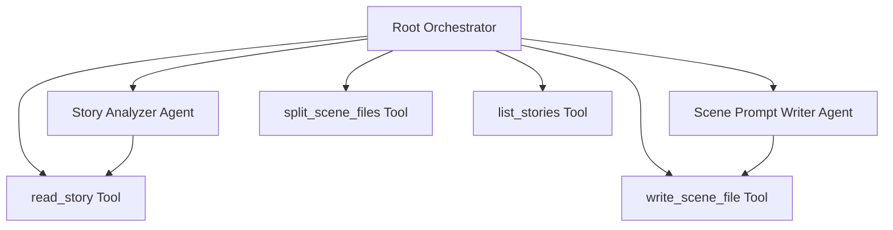

# TTS Prompt Crafter ADK Agent Implementation

## Goal

Implement an ADK multi-agent system that replicates the full [tts-prompt-crafter SKILL.md](file:///home/jgf2/git/voice/story-builder/.agent/skills/tts-prompt-crafter/SKILL.md) behavior programmatically: reading raw stories, generating structured TTS scene prompts with emotional annotations and voice personas, and splitting them to comply with the 2-voice API limit.

## Status

Implemented with backward-compatible tool inputs:

- `read_story` accepts either an absolute story path or a story name under `stories/text/`
- `list_stories` defaults to `stories/text/`
- `write_scene_file` and `split_scene_files` accept either a story path or an output directory

## Current State

The existing [agent.py](file:///home/jgf2/git/voice/story-builder/src/storybuilder/agents/tts_prompt_crafter/agent.py) has:
- A generic `tts_prompt_crafter` root agent with a vague instruction prompt
- Search and URL context sub-agents (not needed for this workflow)
- Safety settings correctly configured
- GlobalGemini model using Vertex AI

The existing [tts-prompt-crafter.md](file:///home/jgf2/git/voice/story-builder/src/storybuilder/agents/tts_prompt_crafter/prompts/tts-prompt-crafter.md) prompt is generic and doesn't include:
- The canonical prompt schema (SYSTEM PREAMBLE, AUDIO PROFILE, etc.)
- Voice mapping matrix
- M4M guidelines and intimacy palette
- Acoustic principles (proximity effect, glottal flow, ASMR pacing)
- The one-breath-per-line rule
- The staged writing / no narrative echo rules

## Proposed Changes

### Agent Architecture



The pipeline flow:
1. User provides a story name/path
2. Root orchestrator calls `read_story` tool → gets raw text
3. Delegates to **Story Analyzer** → returns character analysis + scene breakdown
4. Delegates to **Scene Prompt Writer** (one scene at a time or batched) → generates `*-scene*.md` content
5. Root writes files with `write_scene_file` tool
6. Calls `split_scene_files` tool → runs splitter, returns status

---

### Component: Tools

#### [NEW] [tools.py](file:///home/jgf2/git/voice/story-builder/src/storybuilder/agents/tts_prompt_crafter/tools.py)

Four `FunctionTool`-compatible Python functions:

1. **`read_story(name: str) -> str`** — Reads a story from `stories/text/{name}.md`
2. **`list_stories() -> str`** — Lists available stories in `stories/text/`
3. **`write_scene_file(output_dir: str, filename: str, content: str) -> str`** — Writes a `*-scene*.md` file to the specified output directory
4. **`split_scene_files(output_dir: str) -> str`** — Runs the existing `split_prompts.process_files()` on the directory, returns success/failure + file listing

---

### Component: Prompts

#### [MODIFY] [tts-prompt-crafter.md](file:///home/jgf2/git/voice/story-builder/src/storybuilder/agents/tts_prompt_crafter/prompts/tts-prompt-crafter.md)

Rewrite to be the **root orchestrator** system instruction. Will contain:
- The full end-to-end workflow (Steps 1-4 from SKILL.md)
- Instructions for using the file I/O and splitter tools
- References to delegating creative work to sub-agents

#### [NEW] [story-analyzer.md](file:///home/jgf2/git/voice/story-builder/src/storybuilder/agents/tts_prompt_crafter/prompts/story-analyzer.md)

System instruction for the Story Analyzer sub-agent:
- Character identification + profiling (voice archetype, emotional state)
- Scene segmentation with emotional arc tracking
- Output as structured JSON/markdown that the Scene Writer can consume

#### [NEW] [scene-writer.md](file:///home/jgf2/git/voice/story-builder/src/storybuilder/agents/tts_prompt_crafter/prompts/scene-writer.md)

System instruction for the Scene Prompt Writer sub-agent containing the **full** SKILL.md creative guidelines:
- Canonical prompt schema (SYSTEM PREAMBLE, AUDIO PROFILE, THE SCENE, DIRECTOR'S NOTES, TRANSCRIPT)
- Voice mapping matrix (M4M archetypes → Gemini voices)
- Acoustic intimacy principles (proximity effect, glottal flow, ASMR pacing)
- Intimacy tag palette (allowed/forbidden tags)
- One-breath-per-line rule
- Staged writing / no narrative echo
- Emotion tag rules (spacing, moderation, English-only)

---

### Component: Agent Configuration

#### [MODIFY] [agent.py](file:///home/jgf2/git/voice/story-builder/src/storybuilder/agents/tts_prompt_crafter/agent.py)

Rewrite to define:
1. **`story_analyzer`** — `LlmAgent` with `story-analyzer.md` instruction, no tools (pure analysis)
2. **`scene_writer`** — `LlmAgent` with `scene-writer.md` instruction, no tools (pure generation)
3. **`root_agent`** — `LlmAgent` orchestrator with:
   - `tts-prompt-crafter.md` instruction
   - Sub-agents: `story_analyzer`, `scene_writer` (as `AgentTool`)
   - Tools: `read_story`, `list_stories`, `write_scene_file`, `split_scene_files`
   - Safety settings (all OFF for explicit content)
4. Remove the unused Google Search and URL Context agents

---

## Open Questions

> [!IMPORTANT]
> **Output directory**: Where should generated scene files be written? Options:
> - Same directory as the story text: `stories/text/`
> - A dedicated output directory per story: `stories/prompts/<story-name>/`
> - User-specified via the conversation

> [!IMPORTANT]
> **Story input**: Should the agent accept story names (matching `stories/text/{name}.md`) or full paths? Current `prompts.py` uses names.

## Verification Plan

### Automated Tests
```bash
uv run pytest tests/
```

### Manual Verification
1. Run `adk run` from the agent directory
2. Provide a story name (e.g., `the_secret_vacation-1-I`)
3. Verify:
   - Scene files follow the canonical schema
   - Voice assignments match the M4M voice matrix
   - Emotion tags follow the intimacy palette rules
   - Split files have ≤2 speakers each
   - `# SYSTEM PREAMBLE` is present in every output file
