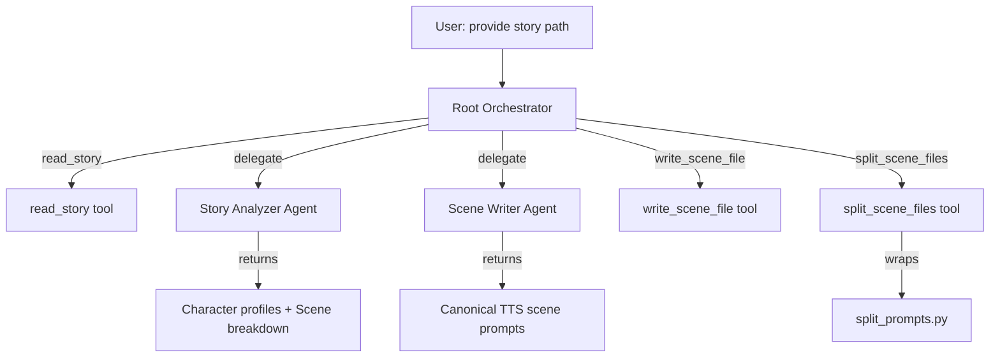

# TTS Prompt Crafter ADK Agent — Walkthrough

## Summary

Implemented a multi-agent ADK system that replicates the full [SKILL.md](file:///home/jgf2/git/voice/story-builder/.agent/skills/tts-prompt-crafter/SKILL.md) behavior programmatically. The agent reads raw stories, generates structured TTS scene prompts with emotional annotations and voice personas, and splits them for 2-voice API compliance.

## Architecture



**Pipeline flow:**

1. User provides a story path → `read_story` loads it
2. `story_analyzer` profiles characters (with Gemini voice mapping) and breaks story into scenes
3. `scene_writer` generates canonical TTS prompts following all SKILL.md guidelines
4. Root writes scene files to `output/` subdirectory via `write_scene_file`
5. `split_scene_files` chunks scenes into ≤2-voice parts

## Files Changed

### New Files

| File | Purpose |
|:-----|:--------|
| [tools.py](file:///home/jgf2/git/voice/story-builder/src/storybuilder/agents/tts_prompt_crafter/tools.py) | 4 FunctionTool-compatible tools: `read_story`, `list_stories`, `write_scene_file`, `split_scene_files` |
| [story-analyzer.md](file:///home/jgf2/git/voice/story-builder/src/storybuilder/agents/tts_prompt_crafter/prompts/story-analyzer.md) | Story Analyzer sub-agent instruction — character profiling with voice matrix, scene segmentation, intimacy level tracking |
| [scene-writer.md](file:///home/jgf2/git/voice/story-builder/src/storybuilder/agents/tts_prompt_crafter/prompts/scene-writer.md) | Scene Writer sub-agent instruction — full SKILL.md creative guidelines (canonical schema, voice matrix, acoustic principles, emotion tags, M4M rules) |
| [test_agent_tools.py](file:///home/jgf2/git/voice/story-builder/tests/test_agent_tools.py) | 15 unit tests covering all tool functions |

### Modified Files

| File | Changes |
|:-----|:--------|
| [agent.py](file:///home/jgf2/git/voice/story-builder/src/storybuilder/agents/tts_prompt_crafter/agent.py) | Replaced generic single-agent with multi-agent architecture (Story Analyzer + Scene Writer + Root Orchestrator). Removed unused Google Search and URL Context agents. |
| [tts-prompt-crafter.md](file:///home/jgf2/git/voice/story-builder/src/storybuilder/agents/tts_prompt_crafter/prompts/tts-prompt-crafter.md) | Rewrote from generic description to concrete orchestrator workflow with tool usage instructions |

## Testing

```
======================== 90 passed, 5 warnings in 31.20s ========================
```

- **75 existing tests**: All pass (no regressions)
- **15 new tests**: All pass (covers read_story, list_stories, write_scene_file, split_scene_files)

## Usage

The agent runs via ADK CLI from the agent directory:

```bash
cd src/storybuilder/agents/tts_prompt_crafter
adk run .
```

Or via the ADK web UI (already running on port 4949):

```bash
adk web --port 4949 --reload --reload_agents
```

Then provide a story path to the agent:

```
Generate TTS prompts for /home/jgf2/git/voice/story-builder/stories/text/the_secret_vacation-1-I.md
```

Output files will be written to `stories/text/output/`.

## Git

Committed on branch `feat/adk-tts-prompt-crafter` as `4f87e29`.
