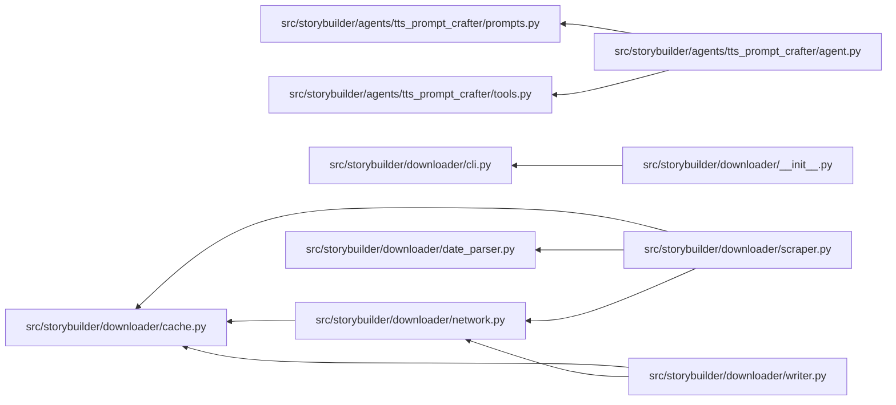
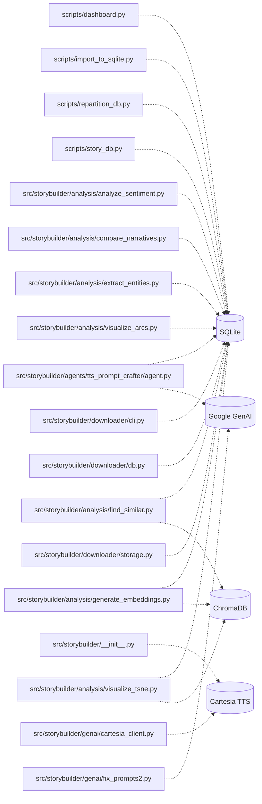
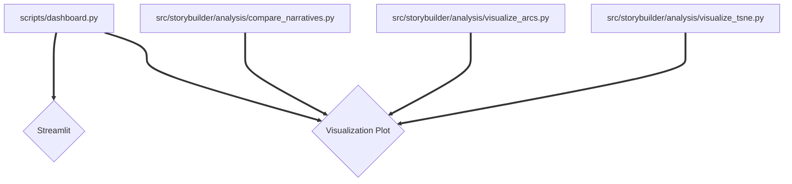

# Codebase Architecture and Flow Diagrams

This document contains Mermaid diagrams visualizing the codebase, automatically generated by the Codebase Diagrammer skill.

---

## 1. Directory & Component Structure
High-level layout of directories and files in the repository.

```mermaid
flowchart TD
    subgraph Root ["Workspace Root"]
        env[".env"]
        gitignore[".gitignore"]
        python_version[".python-version"]
        AGENTS_md["AGENTS.md"]
        CONFIG_TASKS_md["CONFIG_TASKS.md"]
        NLP_TASKS_md["NLP_TASKS.md"]
        README_md["README.md"]
        TASKS_md["TASKS.md"]
        dashboard_html["dashboard.html"]
        ibm_credentials_env["ibm-credentials.env"]
        inerface_md["inerface.md"]
        nlp_analysis_db["nlp_analysis.db"]
        pyproject_toml["pyproject.toml"]
        sentiment_analysis_db["sentiment_analysis.db"]
        sentiment_analysis_db_journal["sentiment_analysis.db-journal"]
        story_builder_architecture_md["story_builder_architecture.md"]
        tsne_visualization_html["tsne_visualization.html"]
        tts_prompt_crafter_db["tts_prompt_crafter.db"]
        uv_lock["uv.lock"]
        workspace_config_yaml["workspace_config.yaml"]
    end

    subgraph vscode ["/.vscode"]
        vscode_settings_json["settings.json"]
    end

    subgraph chroma_db ["/chroma_db"]
        chroma_db_9b6bdea7_f3b3_4a6f_8a5e_6005835ecf1e_data_level0_bin["9b6bdea7-f3b3-4a6f-8a5e-6005835ecf1e/data_level0.bin"]
        chroma_db_9b6bdea7_f3b3_4a6f_8a5e_6005835ecf1e_header_bin["9b6bdea7-f3b3-4a6f-8a5e-6005835ecf1e/header.bin"]
        chroma_db_9b6bdea7_f3b3_4a6f_8a5e_6005835ecf1e_index_metadata_pickle["9b6bdea7-f3b3-4a6f-8a5e-6005835ecf1e/index_metadata.pickle"]
        chroma_db_9b6bdea7_f3b3_4a6f_8a5e_6005835ecf1e_length_bin["9b6bdea7-f3b3-4a6f-8a5e-6005835ecf1e/length.bin"]
        chroma_db_9b6bdea7_f3b3_4a6f_8a5e_6005835ecf1e_link_lists_bin["9b6bdea7-f3b3-4a6f-8a5e-6005835ecf1e/link_lists.bin"]
        chroma_db_chroma_sqlite3["chroma.sqlite3"]
        chroma_db_f4bd437b_554f_435c_b4b6_282b1003e459_data_level0_bin["f4bd437b-554f-435c-b4b6-282b1003e459/data_level0.bin"]
        chroma_db_f4bd437b_554f_435c_b4b6_282b1003e459_header_bin["f4bd437b-554f-435c-b4b6-282b1003e459/header.bin"]
        chroma_db_f4bd437b_554f_435c_b4b6_282b1003e459_index_metadata_pickle["f4bd437b-554f-435c-b4b6-282b1003e459/index_metadata.pickle"]
        chroma_db_f4bd437b_554f_435c_b4b6_282b1003e459_length_bin["f4bd437b-554f-435c-b4b6-282b1003e459/length.bin"]
        chroma_db_f4bd437b_554f_435c_b4b6_282b1003e459_link_lists_bin["f4bd437b-554f-435c-b4b6-282b1003e459/link_lists.bin"]
    end

    subgraph nifty_stories ["/nifty_stories"]
        nifty_stories_metadata_cache_json["metadata_cache.json"]
    end

    subgraph scripts ["/scripts"]
        scripts_dashboard_py["dashboard.py"]
        scripts_import_to_sqlite_py["import_to_sqlite.py"]
        scripts_repartition_db_py["repartition_db.py"]
        scripts_story_db_py["story_db.py"]
        scripts_visualdb_sh["visualdb.sh"]
    end

    subgraph src ["/src"]
        src_storybuilder___init___py["storybuilder/__init__.py"]
        src_storybuilder___main___py["storybuilder/__main__.py"]
        src_storybuilder_agents__adk_session_db["storybuilder/agents/.adk/session.db"]
        src_storybuilder_agents_cartesia_tts_prompt_crafter_emotion_analyzer_yaml["storybuilder/agents/cartesia_tts_prompt_crafter/emotion_analyzer.yaml"]
        src_storybuilder_agents_cartesia_tts_prompt_crafter_markdown_parser_yaml["storybuilder/agents/cartesia_tts_prompt_crafter/markdown_parser.yaml"]
        src_storybuilder_agents_cartesia_tts_prompt_crafter_prompt_formatter_yaml["storybuilder/agents/cartesia_tts_prompt_crafter/prompt_formatter.yaml"]
        src_storybuilder_agents_cartesia_tts_prompt_crafter_root_agent_yaml["storybuilder/agents/cartesia_tts_prompt_crafter/root_agent.yaml"]
        src_storybuilder_agents_cartesia_tts_prompt_crafter_tools___init___py["storybuilder/agents/cartesia_tts_prompt_crafter/tools/__init__.py"]
        src_storybuilder_agents_cartesia_tts_prompt_crafter_tools_prompt_tool_py["storybuilder/agents/cartesia_tts_prompt_crafter/tools/prompt_tool.py"]
        src_storybuilder_agents_cartesia_tts_prompt_crafter_tts_prompt_crafter_yaml["storybuilder/agents/cartesia_tts_prompt_crafter/tts_prompt_crafter.yaml"]
        src_storybuilder_agents_implementation_plan_md["storybuilder/agents/implementation_plan.md"]
        src_storybuilder_agents_task_md["storybuilder/agents/task.md"]
        src_storybuilder_agents_tts_prompt_crafter__adk_eval_history_tts_prompt_crafter_eval_set_1_1781855276_3733985_evalset_result_json["storybuilder/agents/tts_prompt_crafter/.adk/eval_history/tts_prompt_crafter_eval_set_1_1781855276.3733985.evalset_result.json"]
        src_storybuilder_agents_tts_prompt_crafter__adk_session_db["storybuilder/agents/tts_prompt_crafter/.adk/session.db"]
        src_storybuilder_agents_tts_prompt_crafter__env["storybuilder/agents/tts_prompt_crafter/.env"]
        src_storybuilder_agents_tts_prompt_crafter___init___py["storybuilder/agents/tts_prompt_crafter/__init__.py"]
        src_storybuilder_agents_tts_prompt_crafter_agent_py["storybuilder/agents/tts_prompt_crafter/agent.py"]
        src_storybuilder_agents_tts_prompt_crafter_eval_set_1_evalset_json["storybuilder/agents/tts_prompt_crafter/eval_set_1.evalset.json"]
        src_storybuilder_agents_tts_prompt_crafter_prompts__adk_session_db["storybuilder/agents/tts_prompt_crafter/prompts/.adk/session.db"]
        src_storybuilder_agents_tts_prompt_crafter_prompts_gay_ya_md["storybuilder/agents/tts_prompt_crafter/prompts/gay-ya.md"]
        src_storybuilder_agents_tts_prompt_crafter_prompts_scene_writer_md["storybuilder/agents/tts_prompt_crafter/prompts/scene-writer.md"]
        src_storybuilder_agents_tts_prompt_crafter_prompts_story_analyzer_md["storybuilder/agents/tts_prompt_crafter/prompts/story-analyzer.md"]
        src_storybuilder_agents_tts_prompt_crafter_prompts_tts_prompt_crafter_md["storybuilder/agents/tts_prompt_crafter/prompts/tts-prompt-crafter.md"]
        src_storybuilder_agents_tts_prompt_crafter_prompts_py["storybuilder/agents/tts_prompt_crafter/prompts.py"]
        src_storybuilder_agents_tts_prompt_crafter_tests_test_agent_smoke_py["storybuilder/agents/tts_prompt_crafter/tests/test-agent-smoke.py"]
        src_storybuilder_agents_tts_prompt_crafter_tests_test_keys_py["storybuilder/agents/tts_prompt_crafter/tests/test-keys.py"]
        src_storybuilder_agents_tts_prompt_crafter_tests_test_subagent_py["storybuilder/agents/tts_prompt_crafter/tests/test-subagent.py"]
        src_storybuilder_agents_tts_prompt_crafter_tools_py["storybuilder/agents/tts_prompt_crafter/tools.py"]
        src_storybuilder_agents_vertex_ai_py["storybuilder/agents/vertex_ai.py"]
        src_storybuilder_agents_walkthorugh_md["storybuilder/agents/walkthorugh.md"]
        src_storybuilder_analysis___init___py["storybuilder/analysis/__init__.py"]
        src_storybuilder_analysis_analyze_sentiment_py["storybuilder/analysis/analyze_sentiment.py"]
        src_storybuilder_analysis_compare_narratives_py["storybuilder/analysis/compare_narratives.py"]
        src_storybuilder_analysis_extract_entities_py["storybuilder/analysis/extract_entities.py"]
        src_storybuilder_analysis_find_similar_py["storybuilder/analysis/find_similar.py"]
        src_storybuilder_analysis_generate_embeddings_py["storybuilder/analysis/generate_embeddings.py"]
        src_storybuilder_analysis_visualize_arcs_py["storybuilder/analysis/visualize_arcs.py"]
        src_storybuilder_analysis_visualize_tsne_py["storybuilder/analysis/visualize_tsne.py"]
        src_storybuilder_downloader___init___py["storybuilder/downloader/__init__.py"]
        src_storybuilder_downloader_cache_py["storybuilder/downloader/cache.py"]
        src_storybuilder_downloader_cli_py["storybuilder/downloader/cli.py"]
        src_storybuilder_downloader_date_parser_py["storybuilder/downloader/date_parser.py"]
        src_storybuilder_downloader_db_py["storybuilder/downloader/db.py"]
        src_storybuilder_downloader_network_py["storybuilder/downloader/network.py"]
        src_storybuilder_downloader_scraper_py["storybuilder/downloader/scraper.py"]
        src_storybuilder_downloader_storage_py["storybuilder/downloader/storage.py"]
        src_storybuilder_downloader_writer_py["storybuilder/downloader/writer.py"]
        src_storybuilder_genai_cartesia_client_py["storybuilder/genai/cartesia_client.py"]
        src_storybuilder_genai_client_py["storybuilder/genai/client.py"]
        src_storybuilder_genai_fix_prompts_py["storybuilder/genai/fix_prompts.py"]
        src_storybuilder_genai_fix_prompts2_py["storybuilder/genai/fix_prompts2.py"]
        src_storybuilder_genai_play_audio_py["storybuilder/genai/play_audio.py"]
        src_storybuilder_genai_test_voices_py["storybuilder/genai/test_voices.py"]
        src_storybuilder_main_py["storybuilder/main.py"]
    end

    subgraph stories ["/stories"]
        stories_db_1990_db["db/1990.db"]
        stories_db_1991_db["db/1991.db"]
        stories_db_1992_db["db/1992.db"]
        stories_db_1993_db["db/1993.db"]
        stories_db_1994_db["db/1994.db"]
        stories_db_1995_db["db/1995.db"]
        stories_db_1996_db["db/1996.db"]
        stories_db_1997_db["db/1997.db"]
        stories_db_1998_db["db/1998.db"]
        stories_db_1999_db["db/1999.db"]
        stories_db_2000_db["db/2000.db"]
        stories_db_2001_db["db/2001.db"]
        stories_db_2002_db["db/2002.db"]
        stories_db_2003_db["db/2003.db"]
        stories_db_2004_db["db/2004.db"]
        stories_db_2005_db["db/2005.db"]
        stories_db_2006_db["db/2006.db"]
        stories_db_2007_db["db/2007.db"]
        stories_db_2008_db["db/2008.db"]
        stories_db_2009_db["db/2009.db"]
        stories_db_2010_db["db/2010.db"]
        stories_db_2011_db["db/2011.db"]
        stories_db_2012_db["db/2012.db"]
        stories_db_2013_db["db/2013.db"]
        stories_db_2014_db["db/2014.db"]
        stories_db_2015_db["db/2015.db"]
        stories_db_2016_db["db/2016.db"]
        stories_db_2017_db["db/2017.db"]
        stories_db_2018_db["db/2018.db"]
        stories_db_2019_db["db/2019.db"]
        stories_db_2020_db["db/2020.db"]
        stories_db_2021_db["db/2021.db"]
        stories_db_2022_db["db/2022.db"]
        stories_db_2023_db["db/2023.db"]
        stories_db_2024_db["db/2024.db"]
        stories_db_2025_db["db/2025.db"]
        stories_db_2026_db["db/2026.db"]
        stories_db_tts_prompt_crafter_db["db/tts_prompt_crafter.db"]
        stories_text_i_came_during_tryouts_md["text/i_came_during_tryouts.md"]
        stories_text_metadata_cache_json["text/metadata_cache.json"]
        stories_text_output_archive_01_part_md["text/output/archive/01-part.md"]
        stories_text_output_archive_01_scene1_md["text/output/archive/01-scene1.md"]
        stories_text_output_archive_02_part_md["text/output/archive/02-part.md"]
        stories_text_output_archive_02_scene2_md["text/output/archive/02-scene2.md"]
        stories_text_output_archive_03_scene3_md["text/output/archive/03-scene3.md"]
        stories_text_output_archive_04_scene4_md["text/output/archive/04-scene4.md"]
        stories_text_output_archive_05_scene5_md["text/output/archive/05-scene5.md"]
        stories_text_output_archive_06_scene6_md["text/output/archive/06-scene6.md"]
        stories_text_output_i_came_during_tryouts_01_part_md["text/output/i_came_during_tryouts/01-part.md"]
        stories_text_output_i_came_during_tryouts_01_part_wav["text/output/i_came_during_tryouts/01-part.wav"]
        stories_text_output_i_came_during_tryouts_02_part_md["text/output/i_came_during_tryouts/02-part.md"]
        stories_text_output_i_came_during_tryouts_02_part_wav["text/output/i_came_during_tryouts/02-part.wav"]
        stories_text_output_i_came_during_tryouts_03_part_md["text/output/i_came_during_tryouts/03-part.md"]
        stories_text_output_i_came_during_tryouts_03_part_wav["text/output/i_came_during_tryouts/03-part.wav"]
        stories_text_output_i_came_during_tryouts_04_part_md["text/output/i_came_during_tryouts/04-part.md"]
        stories_text_output_i_came_during_tryouts_04_part_wav["text/output/i_came_during_tryouts/04-part.wav"]
        stories_text_output_i_came_during_tryouts_daw_md["text/output/i_came_during_tryouts/daw.md"]
        stories_text_output_the_secret_vacation_1_I_scenes_01_scene1_md["text/output/the_secret_vacation_1_I_scenes/01-scene1.md"]
        stories_text_output_the_secret_vacation_1_I_scenes_01_scene1_wav["text/output/the_secret_vacation_1_I_scenes/01-scene1.wav"]
        stories_text_output_the_secret_vacation_1_I_scenes_02_scene2_md["text/output/the_secret_vacation_1_I_scenes/02-scene2.md"]
        stories_text_output_the_secret_vacation_1_I_scenes_02_scene2_wav["text/output/the_secret_vacation_1_I_scenes/02-scene2.wav"]
        stories_text_output_the_secret_vacation_1_I_scenes_03_scene3_md["text/output/the_secret_vacation_1_I_scenes/03-scene3.md"]
        stories_text_output_the_secret_vacation_1_I_scenes_03_scene3_wav["text/output/the_secret_vacation_1_I_scenes/03-scene3.wav"]
        stories_text_output_the_secret_vacation_1_I_scenes_04_scene4_md["text/output/the_secret_vacation_1_I_scenes/04-scene4.md"]
        stories_text_output_the_secret_vacation_1_I_scenes_04_scene4_wav["text/output/the_secret_vacation_1_I_scenes/04-scene4.wav"]
        stories_text_the_secret_vacation_1_I_md["text/the_secret_vacation-1-I.md"]
        stories_text_the_secret_vacation_1_II_md["text/the_secret_vacation-1-II.md"]
        stories_text_the_secret_vacation_2_I_md["text/the_secret_vacation-2-I.md"]
        stories_text_the_secret_vacation_2_II_md["text/the_secret_vacation-2-II.md"]
    end

    subgraph tests ["/tests"]
        tests_test_agent_tools_py["test_agent_tools.py"]
        tests_test_cartesia_py["test_cartesia.py"]
        tests_test_dashboard_py["test_dashboard.py"]
        tests_test_database_py["test_database.py"]
        tests_test_downloader_py["test_downloader.py"]
        tests_test_genai_py["test_genai.py"]
        tests_test_generate_diagrams_py["test_generate_diagrams.py"]
        tests_test_split_prompts_py["test_split_prompts.py"]
    end
```

---

## 2. Module & File Dependencies
Visualizes import relationships and dependency flows between local scripts and modules.

---

## 3. Key Classes & Functions
Outlines the primary class structures and key functions defined in each module.

```mermaid
classDiagram
    class GlobalGemini {
        +api_client()
    }
    class CharacterName {
        +str name
    }
    class CharacterSchema {
        +CharacterName name
        +str role
        +str voice
        +str voice_archetype
        +str recommended_voice
        +str vocal_qualities
        +str personality_in_brief
        +str emotional_range
    }
    class StorySchema {
        +str title
        +str story
    }
    class IntimacyLevel {
        +str NONE
        +str MILD
        +str MODERATE
        +str HIGH
        +has_explicit_content()
    }
    class PacingNotes {
        +str SLOW
        +str MEASURED
        +str CONVERSATIONAL
        +str FAST
        +str URGENT
    }
    class SceneSchema {
        +NonNegativeInt scene_number
        +str scene_title
        +str location
        +list[CharacterName] characters_present
        +str emotional_tone
        +IntimacyLevel intimacy_level
        +list[str] key_events
        +PacingNotes pacing_notes
        +str start_marker
        +str end_marker
    }
    class VoiceInteractionNotesSchema {
        +list[str] dialogue_heavy_scenes
        +list[str] narrator_heavy_scenes
        +list[str] emotional_transitions
    }
    class SceneAnalysisSchema {
        +list[SceneSchema] scenes
        +VoiceInteractionNotesSchema voice_interaction_notes
    }
    class Genre {
        +str M4M_ROMANCE
        +str M4M_EROTICA
        +str M4M_EROTIC_ROMANCE
        +str YA_COMING_OF_AGE
        +str ADULT_FRIENDS
        +str ADULT_YOUTH
        +str ATHLETICS
        +str AUTHORITARIAN
        +str BEGINNINGS
        +str CAMPING
        +str CELEBRITY
        +str COLLEGE
        +str ENCOUNTERS
        +str FIRST_TIME
        +str HIGH_SCHOOL
        +str HISTORICAL
        +str INCEST
        +str INTERRACIAL
        +str MASTURBATION
        +str MILITARY
        +str NO_SEX
        +str NON_ENGLISH
        +str RELATIONSHIPS
        +str RURAL
        +str SCIENCE_FICTION_OR_FANTASY
        +str URINATION
        +str YOUNG_FRIENDS
        +str POLYAMORY
        +str POLYANDRY
        +str BISEXUAL
        +str GAY
        +str OTHER
    }
    class StoryAnalysisSchema {
        +str title
        +list[Genre] genre_tone
        +str setting
        +str narrative_voice
        +str emotional_arc
        +list[CharacterSchema] characters
        +SceneAnalysisSchema scene_analysis
    }
    class ScenePromptWriterInputSchema {
        +StoryAnalysisSchema story_analysis
        +str raw_story
    }
    class PromptFileSchema {
        +str file_name
        +str content
    }
    class PromptFilesOutputSchema {
        +list[PromptFileSchema] prompt_files
    }
    class dashboard_Module {
        +get_db_files()
        +get_meta_conn()
        +get_nlp_conn()
        +get_filter_options()
        +load_archive_stats()
        +query_stories()
        +get_story_by_path()
        +add_favorite()
        +remove_favorite()
        +get_favorites()
    }
    class import_to_sqlite_Module {
        +init_db()
        +parse_header()
        +import_files()
        +_flush_batch()
        +main()
    }
    class repartition_db_Module {
        +repartition_dbs()
        +get_new_conn()
    }
    class story_db_Module {
        +connect()
        +connect_multi()
        +_query_all()
        +_resolve_connection()
        +cmd_search()
        +cmd_get()
        +cmd_list()
        +cmd_stats()
        +main()
    }
    class init_Module {
        +__getattr__()
    }
    class prompt_tool_Module {
        +save_prompts()
    }
    class prompts_Module {
        +get_prompt()
        +get_story()
    }
    class tools_Module {
        +_resolve_story_path()
        +_resolve_output_dir()
        +read_story()
        +list_stories()
        +write_scene_file()
        +split_scene_files()
    }
    class analyze_sentiment_Module {
        +init_db()
        +get_sentiment_value()
        +extract_chapter_number()
        +main()
    }
    class compare_narratives_Module {
        +main()
    }
    class extract_entities_Module {
        +init_db()
        +is_processed()
        +main()
    }
    class find_similar_Module {
        +main()
    }
    class generate_embeddings_Module {
        +get_chunks()
        +main()
    }
    class visualize_arcs_Module {
        +main()
    }
    class visualize_tsne_Module {
        +main()
    }
    class cache_Module {
        +safe_print()
        +load_cache()
        +save_cache()
    }
    class cli_Module {
        +main()
    }
    class date_parser_Module {
        +parse_nifty_date()
    }
    class db_Module {
        +_parse_author()
        +_parse_output_path()
        +init_db()
        +get_conn()
        +get_partition_path()
        +_get_write_conn()
        +insert_story()
        +story_exists()
        +get_story()
        +optimize_fts()
        +close_db()
    }
    class network_Module {
        +safe_print()
        +rotate_windscribe_ip()
        +fetch_page()
    }
    class scraper_Module {
        +get_subcategories()
        +parse_listing_rows()
        +scrape_subcategory()
        +get_sort_key()
        +scrape_multi_chapter_folder()
        +process_subcategory()
    }
    class storage_Module {
        +upload_many()
    }
    class writer_Module {
        +save_story()
        +download_single_target()
    }
    class cartesia_client_Module {
        +wave_file()
        +parse_speech_config_cartesia()
        +parse_transcript_segments()
        +generate_segment_audio()
        +process_directory_cartesia()
    }
    class client_Module {
        +wave_file()
        +parse_speech_config()
        +get_gemini_api_keys()
        +process_directory()
    }
    class fix_prompts_Module {
        +extract_markdown_block()
        +fix_prompts()
    }
    class fix_prompts2_Module {
        +extract_markdown_block()
        +fix_prompts()
    }
    class play_audio_Module {
        +natural_sort_key()
        +get_audio_player()
        +play_sequence()
    }
    CharacterSchema --> CharacterName
    PromptFilesOutputSchema --> PromptFileSchema
    SceneAnalysisSchema --> SceneSchema
    SceneAnalysisSchema --> VoiceInteractionNotesSchema
    ScenePromptWriterInputSchema --> StoryAnalysisSchema
    SceneSchema --> CharacterName
    SceneSchema --> IntimacyLevel
    SceneSchema --> PacingNotes
    StoryAnalysisSchema --> CharacterSchema
    StoryAnalysisSchema --> Genre
    StoryAnalysisSchema --> SceneAnalysisSchema
```

---

## 4. Data Storage & API Flows
Represents database connections, local caches, APIs, and external services consumed by scripts.

---

## 5. UI & Presentation Layers
Tracks user interfaces, scripts utilizing Streamlit or plotting modules, and entrypoints.

